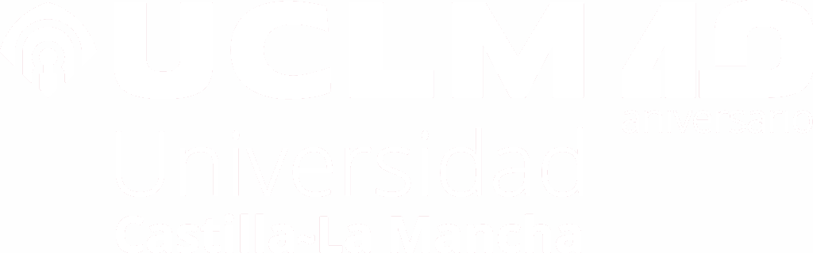

# Informática Industrial · Grado en Ingeniería Electrónica Industrial y Automática

Escuela de Ingeniería Industrial y Aeroespacial de Toledo

Curso 2026 / 27

## Temario

### Bloque 0 — Programación de sistemas embebidos

<a href="tema0_1_arduino_esp32.qmd" class="card-nav">
<h3>Tema 0.1 — Arduino IDE y ESP32</h3>

Entorno Arduino IDE, introducción al NodeMCU ESP32 (Xtensa, WiFi/BT) y primeros programas.

</a>

<a href="tema0_2_estructura_tipos.qmd" class="card-nav">
<h3>Tema 0.2 — Estructura de programas, tipos y variables</h3>

Estructura de programas en C de Arduino, tipos elementales, operadores, ámbito y lectura/escritura por el puerto serie.

</a>

<a href="tema0_3_control_vectores.qmd" class="card-nav">
<h3>Tema 0.3 — Estructuras de control y vectores/matrices</h3>

Selección y repetición en Python y C; vectores y matrices frente a listas y tuplas de Python.

</a>

<a href="tema0_4_punteros_rs232.qmd" class="card-nav">
<h3>Tema 0.4 — Punteros y comunicación RS-232</h3>

Punteros y memoria dinámica en C; comunicación por el puerto RS-232 entre el ESP32 (C) y el ordenador (Python).

</a>

### Bloque 1 — Sistemas SCADA

<a href="tema1_scada.qmd" class="card-nav">
<h3>Tema 1 — Sistemas SCADA</h3>

Arquitectura y módulos de los sistemas de supervisión, control y adquisición de datos; RTU/MTU, HMI, criterios de diseño e IIoT.

</a>

### Bloque 2 — Fundamentos de computadores

<a href="tema2_fundamentos.qmd" class="card-nav">
<h3>Tema 2 — Fundamentos de Computadores</h3>

Arquitectura von Neumann, CPU, memoria, buses y E/S; el ESP32 como caso real de arquitectura embebida.

</a>

### Bloque 3 — Periféricos industriales

<a href="tema3_perifericos.qmd" class="card-nav">
<h3>Tema 3 — Periféricos Industriales</h3>

Controladores, E/S programada, interrupciones, DMA y procesador de E/S en el entorno industrial.

</a>

### Bloque 4 — Redes de comunicaciones industriales

<a href="tema4_redes.qmd" class="card-nav">
<h3>Tema 4 — Redes de Comunicaciones Industriales</h3>

Modelo OSI, Ethernet, TCP/IP, IPv6, TSN y protocolos de aplicación industrial (MQTT, OPC-UA).

</a>

### Bloque 5 — Buses de campo

<a href="tema5_buses.qmd" class="card-nav">
<h3>Tema 5 — Buses de Campo</h3>

RS-232, RS-485 y Modbus como base legacy; EtherCAT, PROFINET/EtherNet-IP, CAN/CANopen y OPC-UA/TSN.

</a>

### Bloque 6 — Sistemas de tiempo real

<a href="tema6_tiempo_real.qmd" class="card-nav">
<h3>Tema 6 — Sistemas de Tiempo Real</h3>

Planificación (ejecutivo cíclico, RMS, EDF), gestión de recursos compartidos y FreeRTOS en ESP32 como caso de estudio.

</a>

### Prácticas

<a href="https://github.com/DavidMunozValero/informatica-industrial-gieia-practicas" class="card-nav" target="_blank">
<h3>Prácticas P1–P6b</h3>

Comunicaciones ESP32 ↔ PC/móvil/wearable: TCP/IP, MQTT+SCADA, BLE, Modbus TCP/OPC-UA y Sistemas de Tiempo Real con FreeRTOS.

</a>

## Sobre este material

Este material docente ha sido diseñado como recurso interactivo para la asignatura
de **Informática Industrial** del Grado en Ingeniería Electrónica Industrial y
Automática de la Universidad de Castilla-La Mancha.

Puedes navegar por los temas desde la barra lateral izquierda. Cada tema incluye:

- **Diagramas interactivos** para visualizar conceptos.
- **Widgets** para experimentar con bits, bases numéricas, puertas lógicas y código.
- **Código Python/C ejecutable** para verificar conceptos de forma práctica.
- **Ejercicios** con soluciones desplegables.

::: callout-note
## Créditos

**Autor:** David Muñoz Valero  
**Departamento:** Tecnologías y Sistemas de Información  
**Escuela de Ingeniería Industrial y Aeroespacial de Toledo — UCLM**  
Curso académico 2026/27
:::